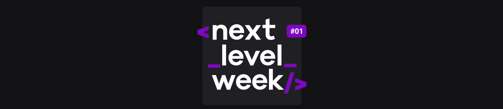
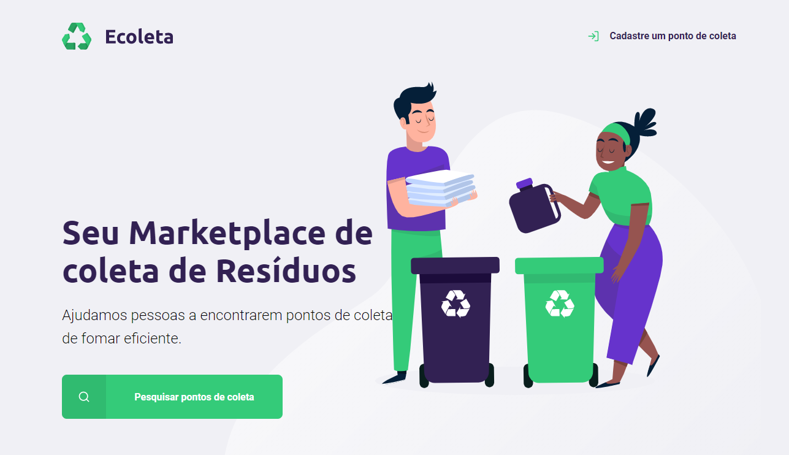
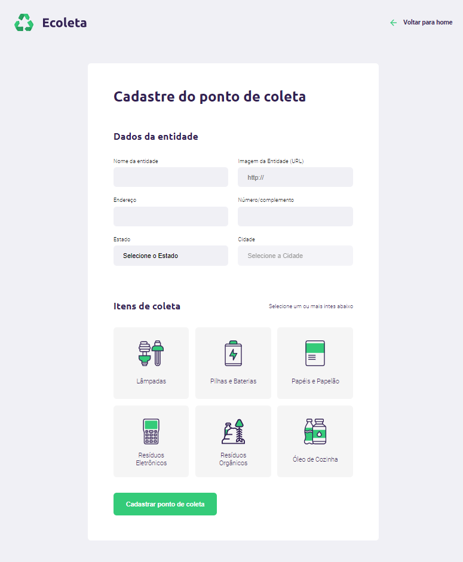
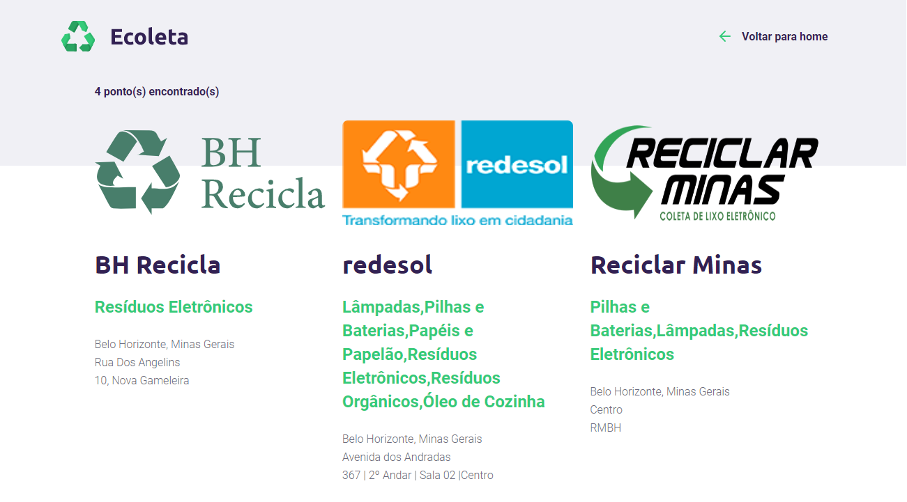

# NLW-rocketseat
Projeto "Ecoleta", Next Level Week da [@Rocketseat](https://github.com/Rocketseat). (01/06 a 07/06) https://nextlevelweek.com/

# 

**O objetivo da aplicação 'Ecoleta' é reunir os pontos de coletas de recicláveis por cidade.**

Pagina Principal:

Pagina de cadastro para novas entidades:

Pagina de pesquisa por pontos de coletas:

---

